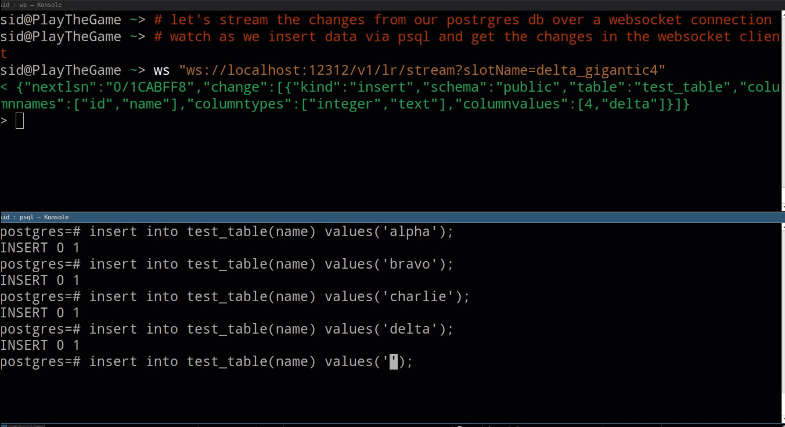

# PGDeltaStream

A golang webserver to stream Postgres changes *atleast-once* over websockets, using Postgres's logical decoding feature.



**Note:** Currently, pgdeltastream is ideal as a reference boilerplate golang server of how to connect to a postgres logical replication slot, take a snapshot and stream changes. It should not be used to expose websockets to arbitrary clients!

## Introduction

PGDeltaStream uses Postgres's logical decoding feature to stream table changes over a websocket connection. It is a stateless service and can be connected directly to a Postgres instance.

PGDeltaStream gives you endpoints to snapshot your current data and then start streaming after the snapshot guaranteeing that you don’t lose any event data. Clients can also ACK an offset value as frequently as they desire over the websocket connection. If a client reconnects, then the stream continues from the last ACKed offset.

This process **guarantees atleast-once delivery** of changes in postgres.

## How it works

When a logical replication slot is created, Postgres creates a snapshot of the current state of the database and records the consistent point from where streaming is supposed to begin. The snapshot helps build an initial state of the database over which streaming changes can be applied.

To facilitate retrieving data from the snapshot and to stream changes from then onwards, the workflow is split into 3 phases:

1. Init: Create a replication slot
2. Snapshot: Get data from the snapshot over HTTP
3. Stream: Stream WAL changes from the snapshot point over a websocket connection

## Installation

Run Postgres [configured for logical replication](#configuring-postgres-for-logical-replication) and [`wal2json`](https://github.com/eulerto/wal2json) installed:

```bash
# Run postgres
$ docker run -it -p 5432:5432 debezium/postgres:10.0
```

Launch PGDeltaStream:

```bash
$ docker run \
    -e DBNAME="postgres" \
    -e PGUSER="postgres" \
    -e PGPASS="''" \
    -e PGHOST="localhost" \
    -e PGPORT=5432 \
    -e SERVERHOST="localhost" \
    -e SERVERPORT=12312 \
    --net host \
    -it hasura/pgdeltastream:v0.1.6
```

## Usage

### Video guide

Watch the [video guide](https://youtube.com) to get a super fast introduction of how to use PGDeltaStream.

### Step 1: Init a replication slot

Call the `/v1/init` endpoint to create a replication slot and get the slot name.

```bash
$ curl localhost:12312/v1/init
{"slotName": "delta_face56"}
```

Keep note of this slot name to use in the next phases.

### Step 2 (optional): Initialise data from snapshot

To get data from the snapshot, make a POST request to the `/v1/snapshot/data` endpoint with the slot name, table name, offset and limit. You can also specify the column and order you want the results to be sorted in:
```
curl -X POST \
  http://localhost:12312/v1/snapshot/data \
  -H 'content-type: application/json' \
  -d '{"slotName": "delta_face56", "table": "test_table", "offset": 0, "limit": 5, "order_by": {"column": "id", "order": "ASC"}}'
```

The returned data will be a JSON formatted list of rows:

```json
[
  {
    "id": 1,
    "name": "abc"
  },
  {
    "id": 2,
    "name": "abc1"
  },
  {
    "id": 3,
    "name": "abc2"
  },
  {
    "id": 4,
    "name": "val1"
  },
  {
    "id": 5,
    "name": "val2"
  }
]
```

Note that only the data upto the time the replication slot was created will be available in the snapshot. 

### Step 3: Stream changes over a websocket

Connect to the websocket endpoint `/v1/lr/stream` along with the slot name to start streaming the changes:

```
ws://localhost:12312/v1/lr/stream?slotName=delta_face56
```

The streaming data will contain the operation type (create, update, delete), table details, old values (in case of an update or delete), new values and the `nextlsn` value. 

The query:

```
INSERT INTO test_table (name) VALUES ('newval1');
```
will produce the following change record over the websocket connection:
```javascript
// Received over ws
{
  "nextlsn": "0/170FCB0",
  "change": [
    {
      "kind": "insert",
      "schema": "public",
      "table": "test_table",
      "columnnames": [
        "id",
        "name"
      ],
      "columntypes": [
        "integer",
        "text"
      ],
      "columnvalues": [
        3,
        "newval1"
      ]
    }
  ]
}
```

The `nextlsn` is the Log Sequence Number (LSN) that points to the next record in the WAL. 

### Step 4: ACK the offset 

To update postgres of the consumed position simply send this value over the websocket connection:
```javascript
// Send over ws
{"lsn":"0/170FCB0"}
```

This will commit to Postgres that you've consumed upto the WAL position `0/170FCB0` so that in case of a failure of the websocket connection, the streaming resumes from this record.

### Reset stream

The application has been designed as a single session use case; i.e. as of now there can be only one replication slot and corresponding stream that can be managed. Any calls to `/v1/init` will delete the existing replication slot, and create a new replication slot (alongwith the snapshot).

At any point if you wish to start over with a new replication slot, call `/v1/init` again to reset the "stream".

## Configuring Postgres for logical replication

To use the logical replication feature, set the following parameters in `postgresql.conf`:

```
wal_level = logical
max_replication_slots = 4
```

Further, add this to `pg_hba.conf`:

```
host    replication     all             127.0.0.1/32            trust
```

Restart the `postgresql` service.

## Slot names

The slots names are autogenerated following the format `delta_<word><number>`. 

This is so that it is easy to remember the slot name instead of a string of random characters and the `delta_` prefix identifies it as a slot created by this application.

## Contributing

Contributions are welcome!

Read the [contributing guide](CONTRIBUTING.md) to learn about setting up the development environment, building the project and running tests.

Do check the [issues](https://github.com/hasura/pgdeltastream/issues) page to see the backlog and help us in improving PGDeltaStream!
